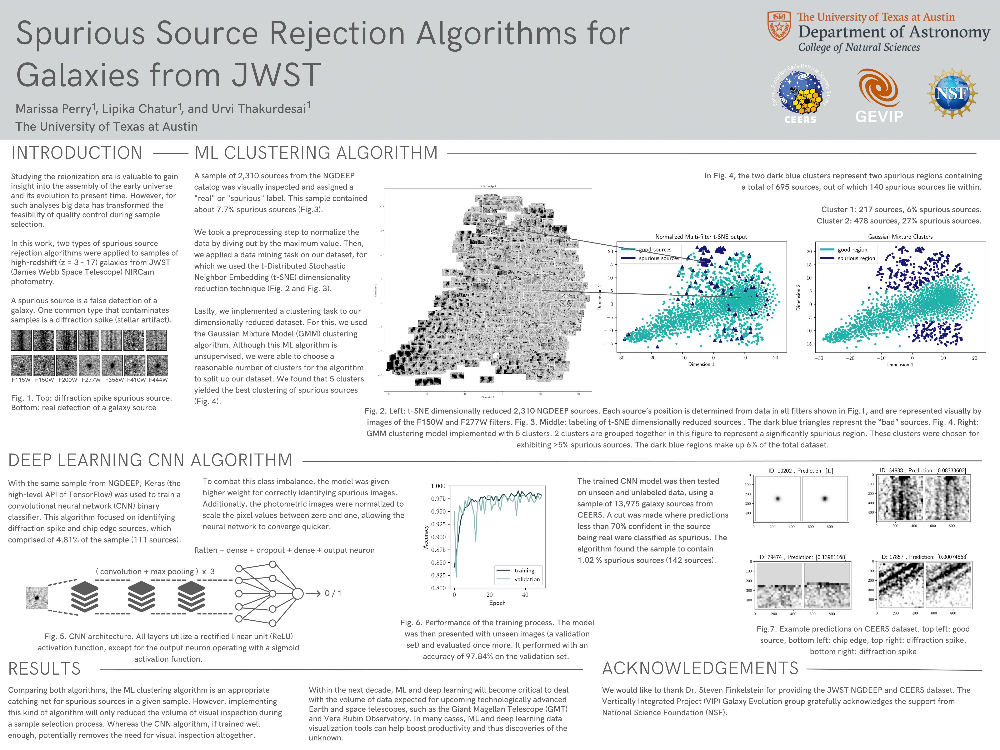

# Inspecting High-Redshift Galaxies from JWST CEERS Using a Clustering Algorithm

(https://sites.utexas.edu/vip/)

* Collaborative project with Lipika Chatur and Urvi Thakurdesai at the University of Texas at Austin within the Galaxy Evolution Vertically Integrated Project (GEVIP) research group !
* Implemented a gaussian mixture clustering algorithm over t-SNE dimensionality reduced photometric images
* Our initial sample included 1816 (z = 6-8) galaxies from the JWST CEERS survey
* We also tested this method with 2310 (z = 3-17) galaxies from the JWST NGDEEP survey
* Developed a method of significantly reducing the amount of data one would go through during the visual inspection process

## Presented Work at UT Austin's Undergraduate Research Forum (April, 2023)

## Presented Work at UT Austin's Dept. of Astronomy Frank N. Bash Symposium (October, 2023)

